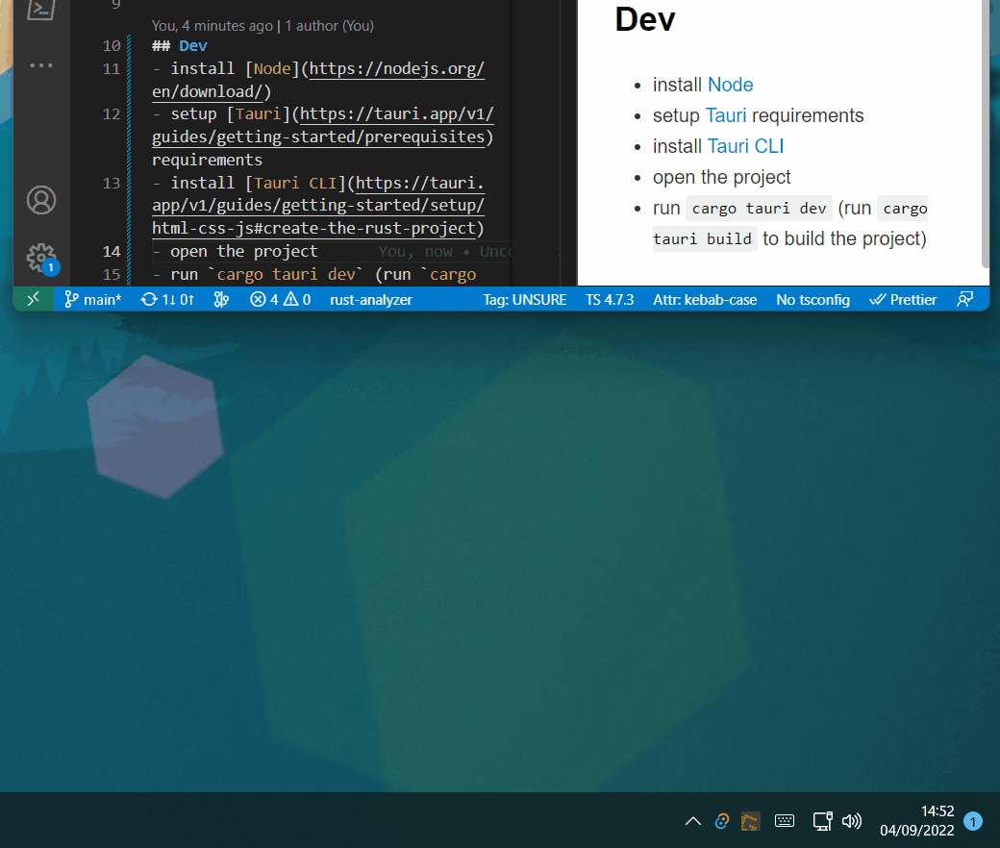

# Layout overlay
Overlay to help with learning a new layer-based Layout

## Layer switching
Layers are triggered by global shortcuts (set to `F13`+ keys) which are setup in [BoardLayout.vue](./src/Components/BoardLayout.vue). There's also an overlay toggle shortcut set to `F24`.  

In order for this to work the same shortcuts have to be send from the keyboard on each layer change. You can see in this [snippet](./layer_switch_qmk_example.c) how it's setup for my QMK board.

## Dev
- install [Node](https://nodejs.org/en/download/)
- setup [Tauri](https://tauri.app/v1/guides/getting-started/prerequisites) requirements 
- install [Tauri CLI](https://tauri.app/v1/guides/getting-started/setup/html-css-js#create-the-rust-project)
- open the project
- run `cargo tauri dev` (run `cargo tauri build` to build the project)